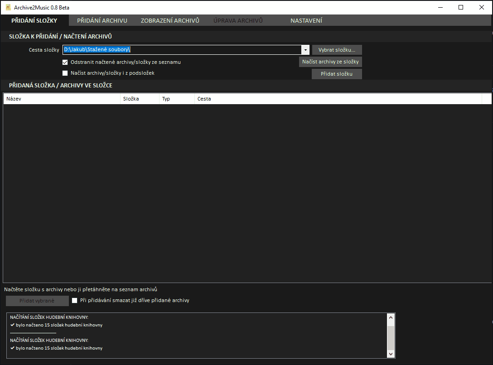
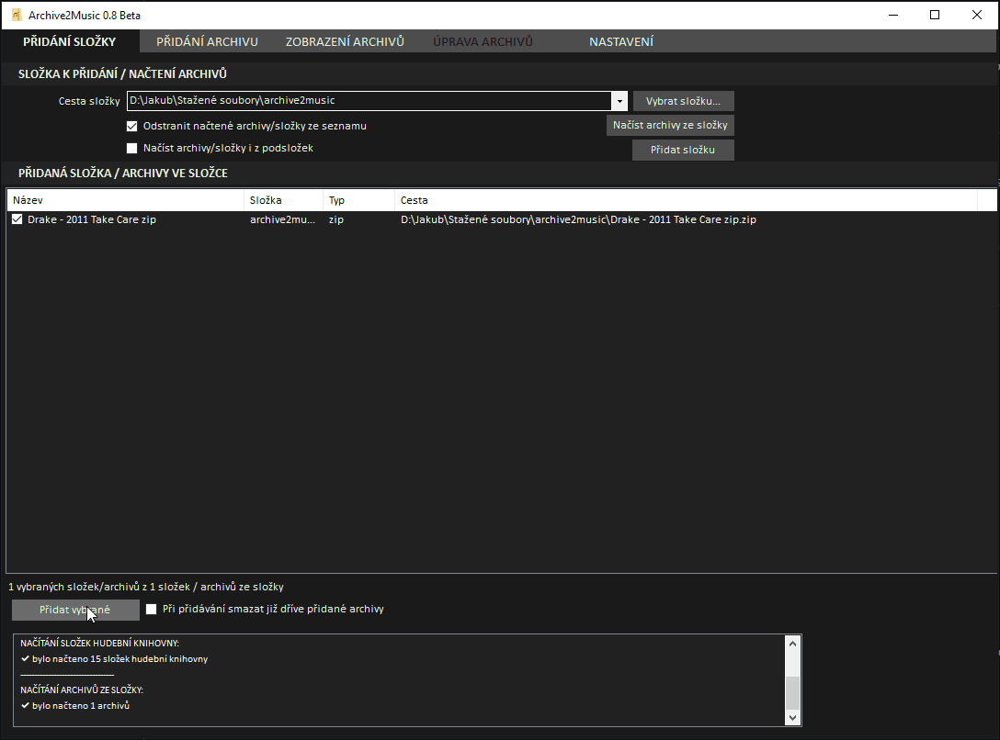

# archive2music

__Please note:__
This program is only in the Czech language!

__Upozornění:__
Program byl primárně vytvořen pro moje osobní použití. Aktuálně existují [omezení](#aktuální-omezení-programu), která budou možná v budoucích verzích odstraněna.

## O programu
Program archive2music slouží k organizaci hudebních alb načtených buďto z archivu (zip, rar apod.) nebo přímo ze složky.

## Stažení programu
Program je volně ke stažení na této adrese:  
[Download here](https://github.com/jakubkastner/archive2music/raw/master/archive2music_installer/Debug/archive2music_installer.msi)

## Funkce programu
* Rozbalení archivu (zip, rar apod.) s hudebním albem.
* Přidání coveru alba do složky k danému albu a ke každému mp3 souboru.
* Pomocí integrace s mp3tag je zajištěno otagování (stopa, skladba, interpret, album, rok, žánr, u mp3 souborů i cover) jednotlivých tracků z alba.
* Převedení hudebních souborů z archivu na mp3 (nejlepší kvalita, cover u každého tracku) nebo opus (nejlepší poměr velikost souboru / výsledná kvalita).
* Automatická organizace hudebního alba do Vaší hudební knihovny *hudební_knihovna/podsložka/interpret/rok_vydání_alba název_alba/*.

## Jak pracovat s programem
1. Načtení složky a zobrazení archivů ve složce  
   
2. Přidání archivů (zip, rar apod.) nebo složek hudebních alb k následnému doplnění informací o albu.
3. Doplnění informací k albu
   1. Interpret
   2. Název alba
   3. Rok vydání alba
   4. Žánr alba
   5. Upřesnění složek
   6. Cover alba  
   vlastní - ze souboru  
   nebo získaný pomocí programu album art downloader, případně pomocí deezer albums search  
   
4. Operace s albumy  
   1. Rozbalení souboru s archivem (tento bod odpadá, pokud přidáme složku místo archivu)
   2. Otevření rozbalených souborů v mp3tag a jejich následná úprava pomocí tagů a apod. díky jednoduché funkci
   3. Převedení na formát mp3 nebo opus pomocí ffmpeg
   4. Případné otevření převedených souborů v programu mp3tag
   5. Přesunutí převedených alb do hudebních knihoven  
   

## Potřebné programy pro funkčnost archive2music
Tyto programy je nutné nainstalovat a v nastavenení programu archive2music nastavit cestu ke spustitelnému exe souboru.
* [ffmpeg](https://www.ffmpeg.org/)
* [WinRAR](https://www.rarlab.com/)  

## Volitelné programy
Tyto programy je možné nainstalovat a v nastavenení programu archive2music nastavit cestu ke spustitelnému exe souboru. Slouží k následnému usnandění práce s alby (získání coveru alba nebo otagování hudebních souborů).
* album art downloader
* deezer albums search
* [mp3tag](https://www.mp3tag.de/)

## Integrace s mp3tag

## Aktuální omezení programu
1. V nastavení je nutné nastavit 2 knihovny (mp3 a opus) - lze nastavit stejné složky a používat pak k převodu pouze jeden typ souboru (mp3/opus)
2. Nelze nastavit typ výsledných hudebních souborů - program převádí hudební soubory na mp3 a opus
3. Nejdou nastavit parametry převodu na hudební soubory (mp3, opus)
4. Nelze nastavit struktura složek alba:  
lze použít pouze defaultně nastavenou cestu - *hudební_knihovna/podsložka/interpret/rok_vydání_alba název_alba/*  
nebo bez podsložek (vhodných např. pro třídění žánru) - *hudební_knihovna/interpret/rok_vydání_alba název_alba/*
