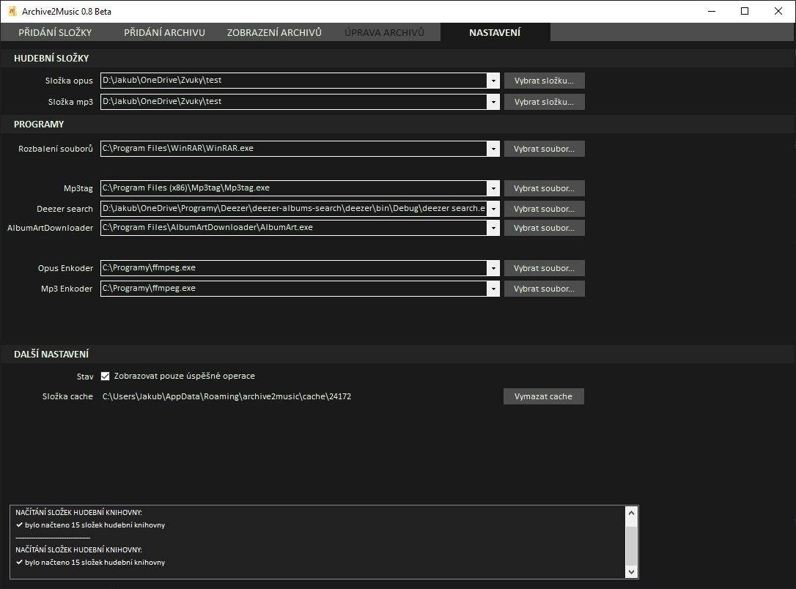

# archive2music

### 🇨🇿 Please note
This program is only in the Czech language!

### ‼ Upozornění
Program byl primárně vytvořen pro moje osobní použití. Aktuálně existují [omezení](#aktuální-omezení), která budou možná v budoucích verzích odstraněna.

1. [ℹ O programu](#ℹ-o-programu)
2. [⏬ Stažení](#-stažení)
3. [🔍 Funkce](#-funkce)
4. [❓ Jak pracovat s programem](#-jak-pracovat-s-programem)
5. [⚠ Potřebné programy pro funkčnost archive2music](#-potřebné-programy-pro-funkčnost-archive2music)
6. [➕ Volitelné programy](#-volitelné-programy)
7. [🛑 Aktuální omezení](#-aktuální-omezení)

## ℹ O programu
Program archive2music slouží k organizaci hudebních alb načtených buďto z archivu (zip, rar apod.) nebo přímo ze složky.

## ⏬ Stažení
Program je volně ke stažení na této adrese:  
* [Download here](https://github.com/jakubkastner/archive2music/raw/master/archive2music_installer/Debug/archive2music_installer.msi)

## 🔍 Funkce
* Rozbalení archivu (zip, rar apod.) s hudebním albem.
* Přidání coveru (vybráním vlastního souboru, nebo automatickým získáním pomocí [externích programů](#volitelné-programy)) alba do složky k danému albu a ke každému mp3 souboru.
* Pomocí [integrace s mp3tag](https://github.com/jakubkastner/archive2music/wiki/2.-Integrace-s-mp3tag) je zajištěno otagování (stopa, skladba, interpret, album, rok, žánr, u mp3 souborů i cover) jednotlivých tracků z alba.
* Převedení hudebních souborů z archivu na mp3 (nejlepší kvalita, cover u každého tracku) nebo opus (nejlepší poměr velikost souboru / výsledná kvalita).
* Automatická organizace hudebního alba do Vaší hudební knihovny *hudební_knihovna/podsložka/interpret/rok_vydání_alba název_alba/*.

## [❓ Jak pracovat s programem](https://github.com/jakubkastner/archive2music/wiki/1.-Jak-pracovat-s-programem)

## ⚠ Potřebné programy pro funkčnost archive2music
Tyto programy je nutné nainstalovat a v nastavenení programu archive2music nastavit cestu ke spustitelnému exe souboru.
* [ffmpeg](https://www.ffmpeg.org/)
* [WinRAR](https://www.rarlab.com/)  

## ➕ Volitelné programy
Tyto programy je možné nainstalovat a v nastavenení programu archive2music nastavit cestu ke spustitelnému exe souboru. Slouží k následnému usnandění práce s alby (získání coveru alba nebo otagování hudebních souborů).
* [Album Art Downloader](https://sourceforge.net/projects/album-art/)
* [deezer albums search](https://github.com/jakubkastner/deezer-albums-search)
* [mp3tag](https://www.mp3tag.de/) (integrace popsána [ve wiki](https://github.com/jakubkastner/archive2music/wiki/2.-Integrace-s-mp3tag))

## 🛑 Aktuální omezení
1. V nastavení je nutné nastavit 2 knihovny (mp3 a opus) - lze nastavit stejné složky a používat pak k převodu pouze jeden typ souboru (mp3/opus)
2. Nelze nastavit typ výsledných hudebních souborů - program převádí hudební soubory na mp3 a opus
3. Nejdou nastavit parametry převodu na hudební soubory (mp3, opus)
4. Nelze nastavit struktura složek alba:  
lze použít pouze defaultně nastavenou cestu - *hudební_knihovna/podsložka/interpret/rok_vydání_alba název_alba/*  
nebo bez podsložek (vhodných např. pro třídění žánru) - *hudební_knihovna/interpret/rok_vydání_alba název_alba/*
